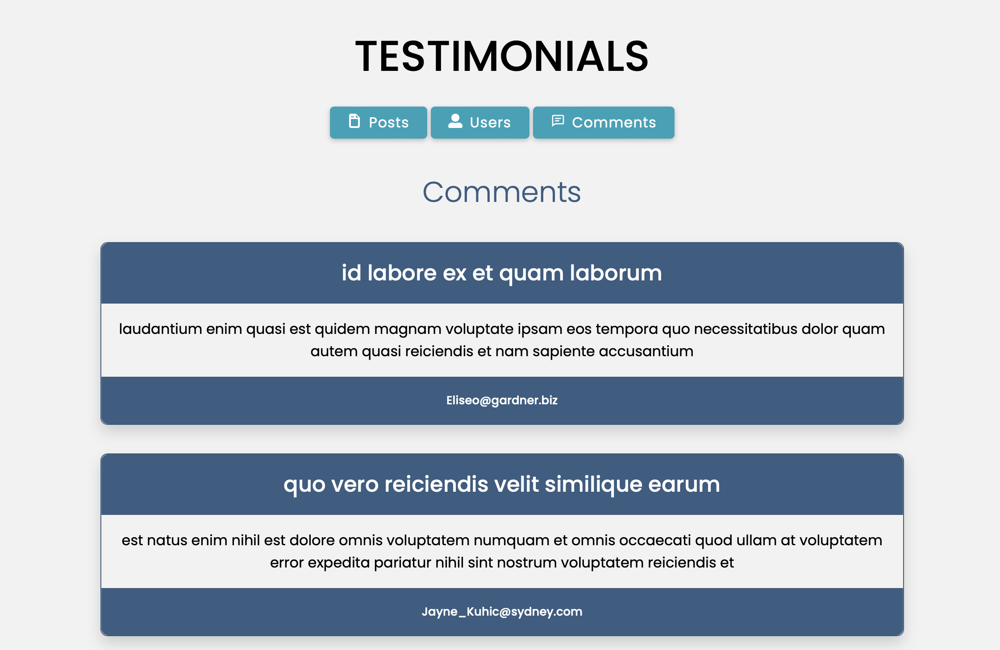

<h1 align="center">👥 Testimonials</h1>
<h3 align="center">Third React project 
 
https://testimonials-webapp.netlify.app

# 03
In writing this code, I have expanded my understanding of various aspects of React and front-end development:

<h4>1. Importing modules and components</h4>
   I've learned how to import various libraries and components, including React's hooks such as <strong>`useState`</strong> and <strong>`useEffect`</strong>, my own custom components like <strong>`Title`</strong> and <strong>`Button`</strong>, and icons from react-icons.
   
<h4>2. State and component lifecycle</h4>
   I've delved deeper into the usage of <strong>`useState`</strong> and <strong>`useEffect`</strong> hooks to manage the state of my component and to carry out specific operations when the component mounts or updates. I used `<strong>`useState`</strong> to define the local state of my component (in this case <strong>`testimonials`</strong> and <strong>`items`</strong>), and <strong>`useEffect`</strong> to perform an API call every time the value of <strong>`testimonials`</strong> changes.
   
<h4>3. API calls</h4>
   I've grasped how to make an API call to <strong>`https://jsonplaceholder.typicode.com/${testimonials}`</strong> using the browser's <strong>`fetch`</strong> function and how to use promises to handle the response.
   
<h4>4. Conditional rendering</h4>
   I've experimented with conditional rendering in React to determine what to show based on the value of the <strong>`testimonials`</strong> and <strong>`items`</strong> state. I've learned to display different messages depending on whether <strong>`testimonials`</strong> is defined or not.
   
<h4>5. Mapping data</h4>
   I've mapped the <strong>`items`</strong> array to create a series of JSX elements based on the data obtained from the API call, thereby learning how to manipulate and display dynamic data.
   
<h4>6. Event handling</h4>
    I've handled events in React, like the <strong>`onClick`</strong>  event on buttons, which has allowed me to update the <strong>`testimonials`</strong> state based on user interaction.

<h4>7. Using props</h4>
    I've passed various props to my <strong>`Title`</strong> and <strong>`Button`</strong>, components, understanding how data can be passed to child components in React and how they can affect the rendering and behavior of these components. 
 

  

  

  

  

### Languages
• HTML 
• CSS 
• [React](https://react.dev) 

## Bundler 
[Vite](https://vitejs.dev)

## Powered by
[JSONPlaceholder](https://jsonplaceholder.typicode.com)

## Webhost
[Netlify](https://www.netlify.com)
